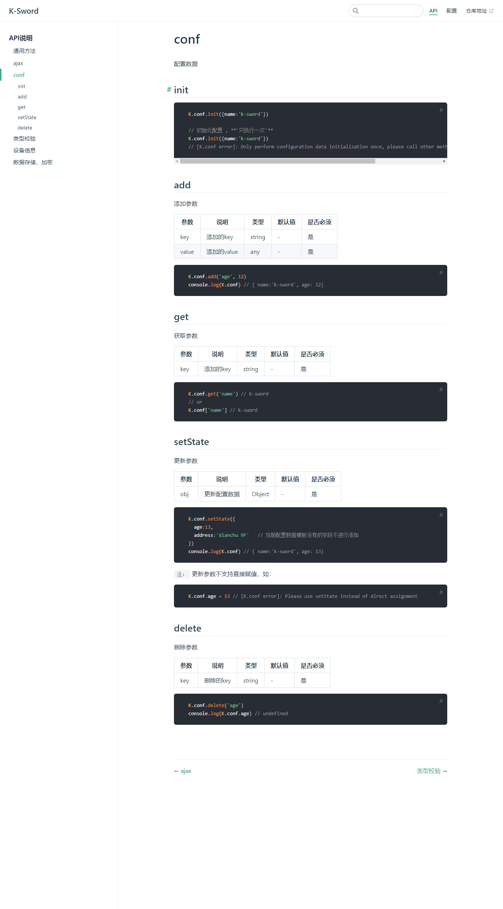
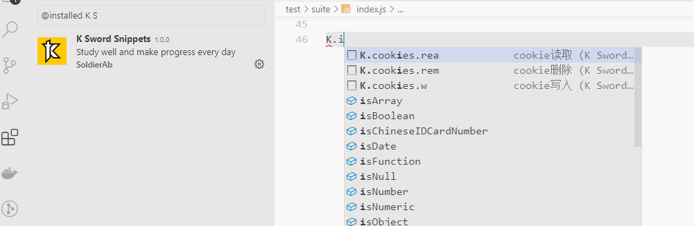

# k-sword

🌈 一个 JavaScript/TypeScript 实用程序库。

## 安装

### Third Party \<script\>标签引入 ( `推荐` )

  ```html
  <script src="https://cdn.jsdelivr.net/npm/k-sword/lib/k-sword.umd.min.js"></script>
  ```

### use
  ```ts
  // 全局使用  K
  // 例如：
  K.ajax.get('http://example.org')

  ```

### 站点预览, 请自行部署

#### 首页


#### API



### VS Code Snippets 插件


