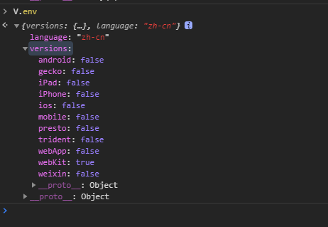

# 设备信息


## getBroswer
#### 获取浏览器类型，返回string
- IE
- Firefox
- Chrome
- Safari
- ''

## env
#### 获取终端基本信息
  

  - versions
    ```js
      trident //IE内核
      presto //opera内核
      webKit //苹果、谷歌内核
      gecko//火狐内核
      mobile //是否为移动终端
      ios //ios终端
      android//android终端
      iPhone //是否为iPhone或者QQHD浏览器
      iPad //是否iPad
      webApp//是否web应该程序，没有头部与底部
      weixin//是否微信
    ```
